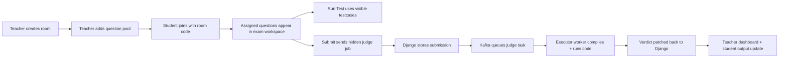

# Judge Vortex

<div align="center">

**A proctored online coding exam platform with async judging, teacher controls, and a multi-file exam workspace.**

[](https://www.djangoproject.com/)
[](https://www.postgresql.org/)
[](https://www.docker.com/)
[](https://kafka.apache.org/)
[](https://redis.io/)
[](./executor_service/sandbox.py)

</div>

---

## Overview

Judge Vortex is built for **supervised coding exams**.

- Teachers can create timed exam rooms, add question pools, edit schedules, block or unblock students, inspect submissions, and monitor room activity.
- Students can join via room code, enter a fullscreen exam flow, solve assigned questions, work across multiple files, run visible testcases, and submit against hidden judge testcases.
- The judge pipeline is asynchronous and separated from the web app using Kafka-backed executor workers.

## Why This Project Stands Out

| Feature | What it does |
| --- | --- |
| Proctored exam mode | Fullscreen-gated exam flow with lobby, timer, room join, kick/block handling, and rejoin restrictions. |
| Multi-file editor | Students can create files, create folders, upload local files, import folder trees, and submit real project-style code. |
| LeetCode-style test flow | `Run Test` uses visible testcases, while `Submit` evaluates hidden judge cases. |
| Teacher operations | Room creation, schedule edits, participant control, question editing, testcase editing, and live submission inspection. |
| Async judge engine | Django API publishes jobs, executor workers compile/run code, results flow back into the app. |
| Social sign-in | Google and GitHub auth paths are wired alongside standard login/signup. |

## Product Flow



## Stack

### Application

- Django
- Django REST Framework
- Django Channels
- Token authentication
- Server-rendered templates with embedded client logic

### Infrastructure

- PostgreSQL as the default database
- Redis for realtime/cache support
- Kafka for submission queueing
- Docker Compose for local and Codespaces orchestration
- Nginx, Prometheus, and Grafana in the infrastructure stack

### Judge Workers

- Core executor: `python`, `javascript`, `ruby`, `php`, `cpp`, `c`, `go`, `rust`, `typescript`, `sql`
- Java executor: `java`
- Codespaces defaults to the faster `native` backend
- Full Linux deployment can use `isolate`

## Quick Start

### Option 1: GitHub Codespaces

This is the fastest way to demo the project.

<details>
<summary><strong>Open and run in Codespaces</strong></summary>

#### 1. Create a Codespace

- Open the repository on GitHub.
- Click `Code`.
- Open the `Codespaces` tab.
- Click `Create codespace on main`.

#### 2. Start the project

```bash
cd /workspaces/judge_vortex
chmod +x start_codespaces.sh start_vortex.sh stop_vortex.sh
./start_codespaces.sh
```

#### 3. Open the app

- Open forwarded port `53562`
- Use the forwarded GitHub URL
- If you want to share it, set port `53562` to `Public`

#### 4. Stop the stack

```bash
cd /workspaces/judge_vortex
./stop_vortex.sh
```

#### Codespaces profile

- core executor replicas: `1`
- java executor replicas: `1`
- backend: `native`
- max concurrency: `4`

</details>

### Option 2: Local Docker Run

<details>
<summary><strong>Start locally with Docker</strong></summary>

#### Prerequisites

- Python 3
- Docker
- Docker Compose plugin

#### Start

```bash
cd judge_vortex
./start_vortex.sh
```

#### Stop

```bash
cd judge_vortex
./stop_vortex.sh
```

#### Default local URLs

- App: `http://127.0.0.1:53562`
- Grafana: `http://localhost:3000`
- Prometheus: `http://localhost:9090`

</details>

## Database

PostgreSQL is now the **default** Django database.

- Default DB container: `postgres:13`
- Default DB name: `judge_vortex_db`
- Default user: `vortex_admin`
- Default host: `127.0.0.1`
- SQLite still works only as an explicit fallback:

```bash
DB_ENGINE=sqlite python3 manage.py check
```

## Environment Notes

### Social login

Google and GitHub login paths are implemented, but they require provider credentials before they are usable.

```bash
GOOGLE_CLIENT_ID=your_google_client_id
GITHUB_CLIENT_ID=your_github_client_id
GITHUB_CLIENT_SECRET=your_github_client_secret
GITHUB_REDIRECT_BASE=https://your-host/login/
```

### Startup controls

Useful flags:

```bash
FORCE_BUILD=1 ./start_vortex.sh
MAKE_MIGRATIONS=1 ./start_vortex.sh
EXECUTOR_BACKEND=isolate ./start_vortex.sh
EXECUTOR_CORE_REPLICAS=2 EXECUTOR_JAVA_REPLICAS=1 ./start_vortex.sh
```

## Exam Experience

### Student side

- Room join with room code
- Fullscreen gate before exam starts
- Lobby countdown
- Question list and problem viewer
- Multi-file project workspace
- Visible testcase runner
- Hidden judge submit flow
- History, output, and saved workspace restoration

### Teacher side

- Create and edit exam rooms
- Edit timings and question pool size
- Add visible and hidden testcases
- Block, unblock, or kick participants
- View submission code, files, output, testcase counts, and metadata

## Repository Map

```text
judge_vortex/
├── core_api/                 Django models, serializers, views, judging logic
├── executor_service/         Judge workers and sandbox logic
├── infrastructure/           Docker Compose, Nginx, Prometheus, Grafana
├── templates/                App UI templates
├── start_vortex.sh           Main local launcher
├── start_codespaces.sh       Codespaces launcher
└── manage.py                 Django entrypoint
```

## Main Files To Know

- [core_api/views.py](./core_api/views.py)
- [core_api/models.py](./core_api/models.py)
- [core_api/serializers.py](./core_api/serializers.py)
- [executor_service/sandbox.py](./executor_service/sandbox.py)
- [executor_service/grader.py](./executor_service/grader.py)
- [templates/workspace.html](./templates/workspace.html)
- [templates/teacher-dashboard.html](./templates/teacher-dashboard.html)
- [infrastructure/docker-compose.yml](./infrastructure/docker-compose.yml)

## Deployment Guidance

For a quick demo:

- GitHub Codespaces works well

For a Linux-hosted deployment:

- use a VM-based target
- keep PostgreSQL, Redis, Kafka, and executor workers together
- use `isolate` only on a proper Linux environment

## Status

```text
Current repo defaults:
- PostgreSQL-backed Django
- Docker-managed infra
- core + java executors enabled
- Codespaces-friendly startup flow
- social auth hooks present
```

---

<div align="center">

Built for real exam flow, not just code execution.

</div>
