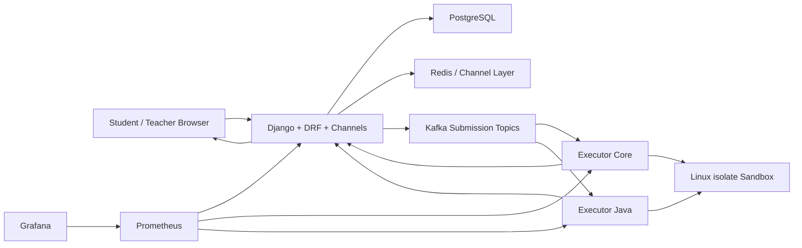
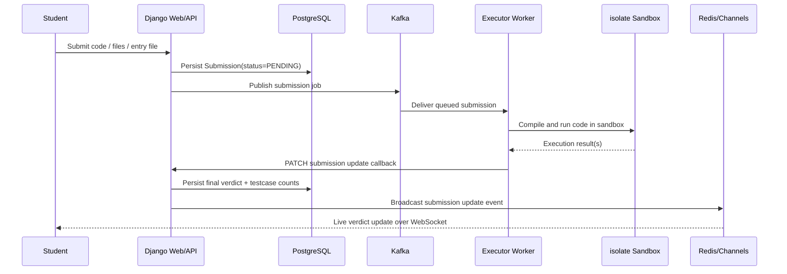

# Judge Vortex

<div align="center">

**A production-style online judge and proctored coding examination platform built around asynchronous execution, secure sandboxing, and real-time exam operations.**

[](https://www.djangoproject.com/)
[](https://www.django-rest-framework.org/)
[](https://channels.readthedocs.io/)
[](https://www.postgresql.org/)
[](https://redis.io/)
[](https://kafka.apache.org/)
[](https://www.docker.com/)
[](./executor_service/sandbox.py)

</div>

---

## Overview

Judge Vortex is an online judge designed for **timed coding exams**, **teacher-led proctoring**, and **real-time verdict delivery**.

Instead of executing code inside the web request path, the platform persists submissions first, publishes them to Kafka, evaluates them in isolated executor workers, and streams verdicts back to students over WebSockets.

That design makes the project much closer to a real backend/distributed-systems system than a simple coding playground.

## 30-Second Recruiter Summary

If you're scanning this repository quickly, the headline is:

- built a **distributed online judge** instead of a synchronous compile-and-run app
- designed a **7-service platform** around Django, PostgreSQL, Redis, Kafka, Docker, and isolated executors
- supports **11 languages**, **8 Kafka partitions**, and **32 isolate boxes** in the local production-style stack
- combines **real-time systems**, **execution isolation**, **proctored exam workflows**, and **platform observability** in one project

## Engineering Highlights At a Glance

| Area | Implementation |
| --- | --- |
| Web/API layer | Django 5 + DRF |
| Realtime layer | Channels + Redis |
| Primary database | PostgreSQL |
| Async execution path | Kafka-backed judging pipeline |
| Execution isolation | Linux `isolate` sandbox |
| Executor topology | 2 executor services (`core`, `java`) |
| Queue parallelism | 8 Kafka partitions |
| Sandbox capacity | 32 isolate boxes |
| Language coverage | 11 languages |
| Submission model | Multi-file workspaces with entry-file routing |
| Moderation | block / unblock / kick / lockout |
| Observability | Prometheus metrics + audit events + lifecycle logs |

## What the System Already Demonstrates

- Django 5 + Django REST Framework for the web and API layer
- Django Channels + Redis for live updates and room-event delivery
- PostgreSQL as the primary application database
- Kafka-backed asynchronous submission processing
- Two executor services with language-based routing
- Linux `isolate` sandbox integration for code execution
- Multi-file student workspaces with explicit entry-file handling
- Visible vs hidden testcase support
- Teacher room management, moderation, lockouts, and submission inspection
- Audit events for major room, participant, and submission actions
- Prometheus metrics and Grafana/Prometheus infrastructure support
- WebSocket-driven student verdict updates

## Why This Project Is Resume-Worthy

Judge Vortex is intentionally built to showcase the kind of backend/platform concepts that are strong signals for internships and distributed-systems interviews:

- asynchronous processing and queue-based decoupling
- secure code execution outside the request lifecycle
- real-time state delivery to connected clients
- failure handling and dependency health checks
- operational observability through metrics and structured logs
- a domain model that reflects real product constraints rather than toy CRUD

## Why This Is More Than a CRUD Project

Judge Vortex demonstrates the kind of engineering tradeoffs that come up in real backend systems:

- decoupling user-facing latency from heavy background work
- routing work across specialized workers instead of one generic process
- preserving correctness under worker restarts and dependency hiccups
- exposing health, metrics, and audit data so the platform is debuggable
- balancing exam integrity, realtime UX, and operational safety in the same system

## Core Product Capabilities

### Problem and Exam Domain

- Teacher-managed exam rooms with room codes
- Question pool creation and question CRUD
- Visible testcase authoring for guided iteration
- Hidden testcase authoring for final evaluation
- Room start time, end time, and join deadline scheduling
- Randomized per-student question assignment
- Rejoin control and room lockouts after moderation or auto-disqualification

### Submission Flow

- Multi-file submissions with nested paths and entry-file selection
- `Run Test` flow for visible cases
- `Submit` flow for hidden judge cases
- Persistent submission records before dispatch
- Async Kafka dispatch from the web tier to executor workers
- Verdict persistence and live verdict broadcast back to the student
- Verdicts including `PASSED`, `WRONG_ANSWER`, `TLE`, `MLE`, `RUNTIME_ERROR`, `COMPILATION_ERROR`, and `SYSTEM_ERROR`

### Proctoring and Moderation

- Teacher participant monitoring
- Kick, block, unblock, and lock actions
- Automatic lockout after fullscreen/tab-violation timeout
- Room event timeline for major actions
- Participant state and solved-question restoration on resume

## High-Level Architecture



## Request Flow: Submission to Verdict



## Service-by-Service Breakdown

### Web Tier

**Django + DRF**
- owns the domain model for rooms, questions, participants, and submissions
- validates incoming requests and submission payloads
- persists every submission before queuing it
- exposes teacher/student APIs and health endpoints

### Realtime Layer

**Django Channels + Redis**
- fans out verdict updates to per-user websocket groups
- supports exam-state notifications without blocking request handlers
- provides the bridge between executor callbacks and live student UI updates

### Persistence

**PostgreSQL**
- stores rooms, questions, participants, submissions, social accounts, and audit events
- keeps exam state durable even if workers restart

### Queue / Coordination

**Kafka**
- decouples submission ingestion from execution
- supports partitioned, async dispatch to executors
- helps keep request latency low even when judge work is expensive

### Execution Layer

**Executor Core + Executor Java**
- consume language-routed submission topics
- compile once and reuse workspaces across judge cases where possible
- push final execution updates back to the web tier

### Isolation Layer

**Linux `isolate`**
- executes code in sandboxed workspaces
- enforces time, memory, and output limits
- cleans up temporary execution state after runs complete

## Security Model for Code Execution

Judge Vortex treats code execution as a separate trust boundary.

Key decisions:

- submitted code never executes inside the Django request path
- execution happens in dedicated worker containers, not in the web process
- Linux `isolate` constrains filesystem/process behavior for judged code
- memory, time, wall-clock, and output limits are applied per run
- multi-file workspaces are normalized to safe relative paths before execution
- unsafe paths such as `..` traversal are rejected before files are written
- hidden testcases are never returned to students in room payloads
- room/question binding prevents cross-room or unassigned-question submissions

## Real-Time Event Flow

The realtime layer is intentionally narrow and easy to explain:

- Django persists the submission update
- Django publishes a per-user event to Channels
- Redis backs the channel layer and group fan-out
- the student websocket receives a normalized event payload with `schema_version` and `event_type`

Current websocket payloads cover:
- submission verdict updates
- participant kick notifications

## Audit Trail

The platform now records major room and submission events in the database:

- room creation, update, deletion
- question creation, update, deletion
- participant join, resume, lock, unlock, kick
- submission receipt, queueing, queue failure, and final update

This makes the system easier to debug, easier to moderate, and much easier to explain in interviews.

## Observability

### Prometheus Metrics

The project exports both framework-level and custom metrics.

Web-tier metrics include:
- submissions received
- submissions queued
- submission verdict counts
- submission end-to-end latency
- room join outcomes
- participant lock/unlock events
- websocket delivery counters
- queue depth gauge
- readiness check results
- audit event counts

Executor metrics include:
- submissions consumed by executor workers
- in-flight grading tasks
- verdict counts by executor/language/status
- executor processing latency
- callback success/failure counts
- executor failure counts by stage

### Structured Lifecycle Logging

The web tier and executor workers now emit structured lifecycle logs around:
- submission receipt
- queue publish success/failure
- executor task start/finish/failure
- callback delivery
- final verdict persistence
- audit event creation

## Health and Reliability Features

Implemented platform hardening now includes:

- liveness endpoint: `/api/health/live/`
- readiness endpoint: `/api/health/ready/`
- dependency checks for database, cache, and Kafka reachability
- fail-open queue throttling if Kafka/Redis is unavailable
- commit-after-persist behavior in executor workers for safer Kafka consumption
- retrying executor callbacks back to Django before surfacing failure
- Docker healthchecks for Postgres, Redis, Kafka, Nginx, and executor services
- audit-backed moderation trail for room actions

## Language Support

Current active support:

- `python`
- `javascript`
- `ruby`
- `php`
- `cpp`
- `c`
- `go`
- `rust`
- `typescript`
- `sql`
- `java`

## Repository Structure

```text
judge_vortex/
├── core_api/                    domain models, APIs, serializers, audit, health, metrics
├── executor_service/            executor workers, isolate sandbox, grading, worker observability
├── infrastructure/              Docker Compose, nginx, Prometheus, Grafana wiring
├── realtime/                    Channels consumers and websocket routing
├── shared/                      pure judging helpers shared by web and executor layers
├── templates/                   teacher dashboard, workspace, auth and landing pages
├── execution_routing.py         topic and executor routing by language
├── kafka_setup.py               Kafka topic bootstrap and partition management
├── start_vortex.sh              local platform launcher
├── start_codespaces.sh          Codespaces launcher
├── stop_vortex.sh               local shutdown script
├── Makefile                     developer shortcuts
└── README.md                    architecture and project narrative
```

## Important Files

- [core_api/views.py](./core_api/views.py)
- [core_api/models.py](./core_api/models.py)
- [core_api/serializers.py](./core_api/serializers.py)
- [core_api/audit.py](./core_api/audit.py)
- [core_api/metrics.py](./core_api/metrics.py)
- [core_api/health.py](./core_api/health.py)
- [executor_service/main.py](./executor_service/main.py)
- [executor_service/grader.py](./executor_service/grader.py)
- [executor_service/sandbox.py](./executor_service/sandbox.py)
- [executor_service/observability.py](./executor_service/observability.py)
- [execution_routing.py](./execution_routing.py)
- [infrastructure/docker-compose.yml](./infrastructure/docker-compose.yml)

## Local Setup

### 1. Install Python dependencies

```bash
python3 -m pip install -r requirements.txt
```

### 2. Configure environment

```bash
cp .env.example .env
```

### 3. Start the platform

```bash
./start_vortex.sh
```

### 4. Stop the platform

```bash
./stop_vortex.sh
```

## Useful Make Targets

```bash
make start
make stop
make migrate
make check
make test
make test-fast
make kafka-topics
```

## Testing

Run the full Django test suite:

```bash
python3 manage.py test
```

Fast local test pass with SQLite:

```bash
DB_ENGINE=sqlite python3 manage.py test core_api.tests realtime.tests
```

## Scaling Notes

Judge Vortex is already shaped like a horizontally scalable system.

Current scaling levers:
- Kafka partitions are configurable and currently default to `8`
- executor families are split by language route
- executor replica counts are controlled through environment variables
- isolate box count is configurable and currently defaults to `32` in Compose
- queue depth is exposed for operational visibility

Natural next steps for scaling:
- add more executor replicas per topic
- introduce dead-letter/retry escalation beyond current at-least-once callback persistence
- move the web tier from `runserver` to a dedicated ASGI process manager in production
- shard heavy language families into separate executor pools if needed

## Tradeoffs and Future Improvements

Intentional tradeoffs in the current design:

- websocket delivery is intentionally simple and centered on per-user channels
- callback auth is still lightweight and could be hardened further for internet-facing deployment
- queue retry semantics rely on Kafka redelivery plus callback persistence rather than a full DLQ workflow
- startup scripts are optimized for local reproducibility rather than a full production orchestrator

Strong future improvements:
- dead-letter queue and replay tooling
- signed internal executor callbacks
- per-room suspicious-event analytics
- autoscaling executor workers from queue lag
- richer teacher timeline UI on top of the audit event model

## Interview Talking Points

1. **Why Kafka instead of judging synchronously?**
   To keep request latency low and isolate expensive compilation/execution from the web tier.

2. **Why Redis if Kafka already exists?**
   Kafka handles durable async work; Redis backs low-latency websocket fan-out for live UI updates.

3. **Why split executors by language family?**
   Different toolchains have different runtime costs and scaling needs. Routing by language keeps workers simpler and scaling more intentional.

4. **Why store submissions before queueing them?**
   It gives the system a durable source of truth even if Kafka or a worker is temporarily unavailable.

5. **How do you enforce exam integrity?**
   Room-level assignment, fullscreen gating, lockouts, teacher moderation, and hidden testcase protection all reinforce exam constraints.

## Resume-Friendly Highlights

- Built a **7-service online judge platform** with Django, DRF, Channels, PostgreSQL, Redis, Kafka, Docker, and Linux `isolate`, supporting **11 languages**, **8 Kafka partitions**, and **32 sandbox slots** for asynchronous code evaluation.
- Designed a queue-backed execution pipeline with language-routed executor workers, durable submission persistence, structured audit events, health/readiness checks, Prometheus metrics, and websocket verdict delivery to keep the web tier responsive under load.
- Implemented proctored exam workflows including timed rooms, randomized question assignment, visible vs hidden testcase evaluation, participant moderation, lockouts, and multi-file workspaces to model realistic coding assessments rather than toy judge behavior.

---

<div align="center">

**Judge Vortex is built as a serious backend system first: asynchronous, isolated, observable, and explainable.**

</div>
