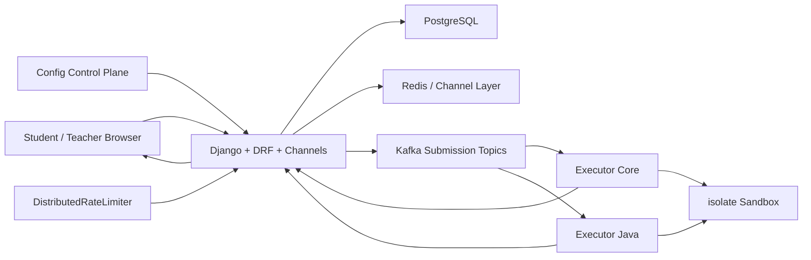

# Judge Vortex

Judge Vortex is a proctored coding-exam platform with asynchronous judging, real-time verdict delivery, teacher moderation tools, and platform integrations for runtime configuration and distributed submission control.

It is built for the kind of environment where many students submit code at the same time, teachers need live visibility into activity, and code execution must stay isolated from the web request path.

## What It Does

Judge Vortex covers the full exam workflow:

- teacher-managed rooms and question sets
- student workspaces with multi-file submissions and entry-file selection
- `Run Test` and final `Submit` flows
- realtime verdict updates over WebSockets
- teacher-side monitoring, moderation, block/unblock, kick, and audit events
- suspicious activity signals and room integrity controls

The judging path is asynchronous by design:

1. the web tier validates and stores the submission
2. the job is published to Kafka
3. executor workers compile and run code inside isolated sandboxes
4. final verdicts are written back to the application
5. students receive live status updates in the UI

## Platform Role

Judge Vortex is the public-facing service in a three-project platform:

- `Judge Vortex`: exam and judging application
- `Config Control Plane`: runtime configuration, staged rollout, rollback, and live config delivery
- `DistributedRateLimiter`: submission control and shared rate-limit decisions

In the deployed platform, Judge Vortex can:

- resolve runtime configuration from Config Control Plane
- switch limiter behavior through `judge-vortex.runtime`
- consult DistributedRateLimiter for submission decisions when the queue is under pressure
- expose unified metrics for application health, judging, and traffic behavior

## Core Architecture

## Technical Highlights

- Django 5 + Django REST Framework for the API and domain logic
- Django Channels + Redis for realtime room and verdict delivery
- PostgreSQL as the primary system of record
- Kafka-backed judging pipeline for asynchronous execution
- language-routed executor services
- Linux `isolate` sandboxing for compilation and execution safety
- bounded retries and dead-letter handling for failed jobs
- multi-file workspace support with explicit entry-file routing
- Prometheus instrumentation and Grafana/Prometheus monitoring support

## Product Capabilities

### Exam Management

- exam rooms with room codes and teacher ownership
- question authoring with visible and hidden testcases
- per-room scheduling controls
- randomized per-student question assignment
- participant state restoration after reconnect

### Student Workspace

- multi-file editor
- entry-file aware execution
- multiple language support
- visible testcase iteration with `Run Test`
- hidden judge evaluation with `Submit`

### Teacher Experience

- participant presence and activity visibility
- live code visibility across assigned questions
- moderation controls
- room-level event visibility and audit trails

### Judging Pipeline

- persistent submissions before dispatch
- Kafka-based queue decoupling
- isolated executor workers
- final verdict categories including:
  - `PASSED`
  - `WRONG_ANSWER`
  - `TLE`
  - `MLE`
  - `RUNTIME_ERROR`
  - `COMPILATION_ERROR`
  - `SYSTEM_ERROR`

## Security and Isolation

Judge Vortex treats code execution as a separate trust boundary.

- submitted code does not run inside the Django request process
- executors run in dedicated containers
- code runs inside isolated sandboxes with time, memory, and output limits
- unsafe paths are rejected before workspace files are written
- hidden testcases stay server-side
- room/question assignment is validated before acceptance

## AWS Deployment

This project is deployed as part of an AWS-hosted platform stack. In that environment:

- Judge Vortex is the main public application
- PostgreSQL, Redis, Kafka, executors, and monitoring run alongside the app tier
- Config Control Plane and DistributedRateLimiter are connected as internal platform services
- Prometheus and Grafana provide operational visibility for the full stack

## Observability

The application exposes operational signals for:

- submission volume and verdict distribution
- executor activity and processing latency
- room and participant lifecycle events
- health and readiness state
- realtime delivery behavior

## Repository Structure

- `core_api/`: domain models, API views, throttles, moderation, and exam logic
- `executor_service/`: worker processes, grading, and sandbox integration
- `shared/`: judging helpers shared across web and executor layers
- `templates/`: student and teacher UI
- `infrastructure/`: Docker Compose, monitoring, and deployment support
- `judge_vortex/`: Django project configuration

## Summary

Judge Vortex is an exam platform built around asynchronous execution, isolation, realtime delivery, moderation, and operational visibility, with the surrounding platform services connected for runtime control and submission governance.
