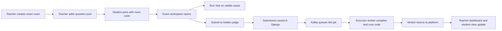

# Judge Vortex

<div align="center">

**A proctored online coding examination platform built for real-time contest flow, teacher control, and asynchronous code judging.**

[](https://www.djangoproject.com/)
[](https://www.postgresql.org/)
[](https://kafka.apache.org/)
[](https://redis.io/)
[](https://www.docker.com/)
[](./executor_service/sandbox.py)

</div>

---

## What It Is

Judge Vortex is an **online judge designed for supervised coding exams**.

It combines:

- a **teacher dashboard** for room management, scheduling, question control, participant monitoring, and submission review
- a **student exam workspace** with fullscreen-gated exam mode, multi-file editing, visible testcase execution, and hidden testcase submission
- an **asynchronous judge pipeline** that separates the web app from code execution

The product is aimed at the gap between a normal coding playground and a real exam system: timed rooms, invigilation-oriented constraints, teacher moderation, and contest-style submission flow.

## The Core Idea

Most coding platforms do one of these well:

- online practice
- timed contests
- classroom management

Judge Vortex is built to bring those together in one system:

- **teachers** create structured exam rooms
- **students** receive assigned questions inside a restricted workspace
- **submissions** move through a queue-backed judging pipeline
- **results** flow back into the exam and dashboard in real time

## Key Capabilities

### Teacher Experience

- Create and manage timed exam rooms
- Set room schedules and question-pool counts
- Add and edit coding questions
- Configure both **visible** and **hidden** testcases
- Block, unblock, or kick students from a room
- Monitor participants and submissions from one dashboard
- Inspect student code, outputs, testcase counts, language, and timestamps

### Student Experience

- Join exam rooms with a room code
- Enter a fullscreen-controlled exam flow
- Work inside a dedicated coding workspace
- Create files, create folders, upload files, and import folder trees
- Run **visible testcases** before submission
- Submit against **hidden judge testcases**
- Navigate question history and continue from saved workspace state

### Judge Pipeline

- Django receives and stores submissions
- Kafka queues judging work asynchronously
- Executor workers compile and run code outside the web request cycle
- Hidden testcase results update the submission state and scoring
- The platform supports a judge architecture that is compatible with Linux `isolate`

## Why It Feels Different

| Area | Judge Vortex approach |
| --- | --- |
| Exam flow | Fullscreen-gated, timed, room-based exam flow instead of a generic playground |
| Question solving | LeetCode-style split between visible testcase runs and hidden testcase submit |
| Workspace | Multi-file exam editor instead of a single-textarea submission box |
| Moderation | Teachers can actively monitor, block, unblock, and inspect participant activity |
| Judging | Async queue-based architecture rather than direct in-request execution |
| Realism | Built around actual exam friction: timing, room control, rejoin rules, and participant oversight |

## Product Workflow



## Exam UI Model

The student experience is intentionally structured more like a modern coding platform than a plain exam form.

- question navigation on one side
- problem statement panel
- visible testcase section beneath the statement
- editor and file tree workspace for writing solutions
- contest-style output and submission history

This gives the student a more natural solving flow while still keeping the room under exam restrictions.

## Architecture

### Web Layer

- Django
- Django REST Framework
- Django Channels
- server-rendered templates with embedded application logic

### Data and Messaging

- PostgreSQL as the primary database
- Redis for realtime and support services
- Kafka for submission queueing

### Execution Layer

- dedicated executor workers
- compile/run pipeline separated from the main request path
- Linux `isolate` compatible judge backend

### Infrastructure

- Docker Compose orchestration
- Nginx, Prometheus, and Grafana support in the stack

## Language Support

Currently supported through the active executor setup:

- `python`
- `javascript`
- `ruby`
- `php`
- `cpp`
- `c`
- `go`
- `rust`
- `typescript`
- `sql`
- `java`

## Security and Proctoring-Oriented Controls

Judge Vortex is designed with exam supervision in mind, including:

- fullscreen entry requirements
- timed lobby and deadline flow
- teacher-controlled kicks and lockouts
- room-based participation tracking
- submission-to-room binding
- restricted rejoin behavior after disqualification

It is not positioned as a generic code sandbox first. It is positioned as an **exam system with a judge engine**.

## Notable Product Features

<details>
<summary><strong>Multi-file exam workspace</strong></summary>

Students can work with more than one file inside the exam workspace, create folders, import local project files, and submit a structured workspace instead of a single code blob.

</details>

<details>
<summary><strong>Visible vs hidden testcase model</strong></summary>

Visible testcases are intended for guided iteration, while hidden testcases preserve actual evaluation integrity during submission.

</details>

<details>
<summary><strong>Teacher-side submission inspection</strong></summary>

Teachers can inspect not only verdicts, but also the student’s code, file structure, testcase counts, output, language choice, and submission timing.

</details>

<details>
<summary><strong>Async judge design</strong></summary>

The request path remains lightweight because submissions are persisted first and then processed through executor workers, instead of blocking the web thread for code execution.

</details>

## Repository Structure

```text
judge_vortex/
├── core_api/                 core models, APIs, serializers, judging logic
├── executor_service/         executor workers and sandbox pipeline
├── infrastructure/           docker, nginx, monitoring, service wiring
├── templates/                student and teacher UI templates
├── start_vortex.sh           main launcher
├── start_codespaces.sh       codespaces launcher
└── manage.py                 django entrypoint
```

## Important Files

- [core_api/views.py](./core_api/views.py)
- [core_api/models.py](./core_api/models.py)
- [core_api/serializers.py](./core_api/serializers.py)
- [core_api/judging.py](./core_api/judging.py)
- [executor_service/sandbox.py](./executor_service/sandbox.py)
- [executor_service/grader.py](./executor_service/grader.py)
- [templates/workspace.html](./templates/workspace.html)
- [templates/teacher-dashboard.html](./templates/teacher-dashboard.html)

## Current Direction

Judge Vortex is moving toward a stronger production-style exam architecture:

- PostgreSQL-backed application state
- queue-driven judging
- Linux-compatible isolated execution
- teacher moderation and student workspace realism

The project is intentionally evolving beyond a simple “compile and run code” site into a more complete **assessment platform**.

---

<div align="center">

**Built as an online exam system first, and a judge second.**

</div>
